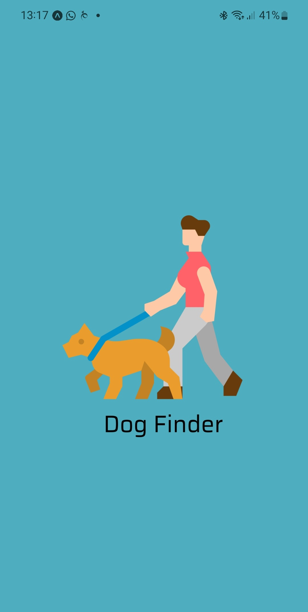
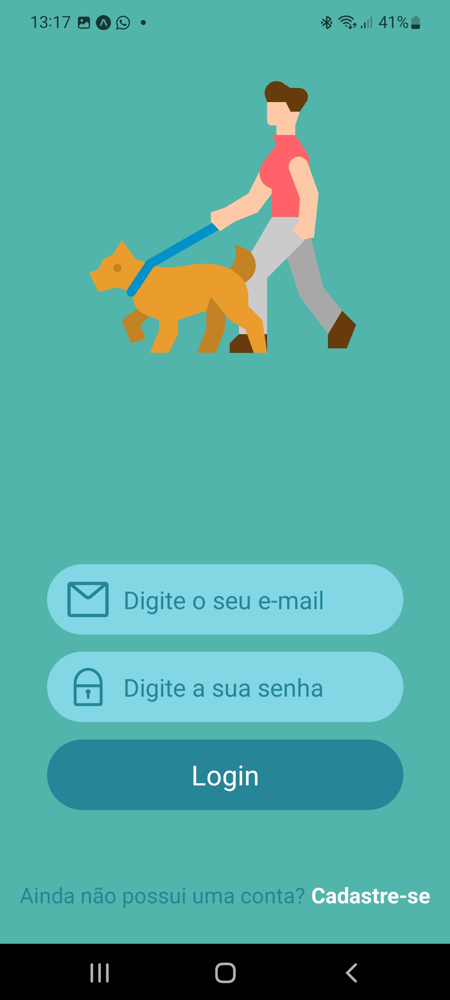

# 🐕 Projeto Mobile DogWalker

Projeto em Expo/React Native que implementa um pequeno CRUD.

> ⚠️ **Projeto utilizado nas aulas da disciplina de Programação para Dispositivos Móveis da [Fatec Itu](fatecitu.edu.br)**

<p align="center">
  
<a href="https://fatecitu.edu.br" target="_blank">
  
  </a>
</p>
<p align="center">
 
 
   
</p>

# 🧠 Contexto

Uma das dificuldades dos desenvolvedores de é implementar um pequeno CRUD que possua autenticação, sem antes se envolver em um framework web, como o Vue, Angular ou React.
O propósito desse pequeno sistema é mostrar que é possível desenvolvermos uma aplicação 100% na nuvem, utilizando apenas HTML, CSS e Javascript.
## 📋 Instruções

- [ ] Inicialmente clone o projeto; 
- [ ] Instale as dependências com ```npm i```
- [ ] Inicie o projeto com ```npx expo start```


## 🌐 Veja uma demonstração online do projeto. 


## 📷 Imagens do Projeto
<table>
<tr>
<td></td>
<td></td>
</tr>
<tr>
<td></td>
<td></td>
</tr>
</table>


## 💬 Contato

Prof. Ms. Ricardo Leme <br>
<a href="https://www.linkedin.com/in/ricardo-leme/" target="_blank">
  
</a>
<a href="mailto:ricardo.leme@fatec.sp.gov.br" target="_blank">
  
</a>

## 📝 Licença

Esse projeto está sob a licença Apache. Veja o arquivo [LICENSE](LICENSE) para mais detalhes.
---
Made with 💜, HTML, CSS and only Vanilla JS. 
---
## ⚠️Erros no Swiper

Vá até node_modules/react-native-swiper/index.js
Substitua as linhas:
```
module.exports = Swiper;
module.exports.default = Swiper;
```
por:
```
export default Swiper
export {Swiper}
```